# Markpion: Core Design

How Markpion is built: its layers, the security boundary, how documents are opened, edited, previewed and saved, and how the app is released and updated. The diagrams are [Mermaid](https://mermaid.js.org/); they render on GitHub and in Markpion's own preview.

Requirements are in [SRS.md](SRS.md) and their implementation status in [TRACEABILITY.md](TRACEABILITY.md). This document describes the code as of version 0.18.0; when the code and this document disagree, the code is right and this document needs fixing.

## 1. System context

Markpion is a local-first desktop app. Documents are ordinary Markdown files on the user's disk; nothing is uploaded. The only network request the app makes on its own is the update check, which asks GitHub for the latest release and can be turned off. The optional AI assistant sends text to Anthropic's Claude API only when the user runs an AI command, with their own key.

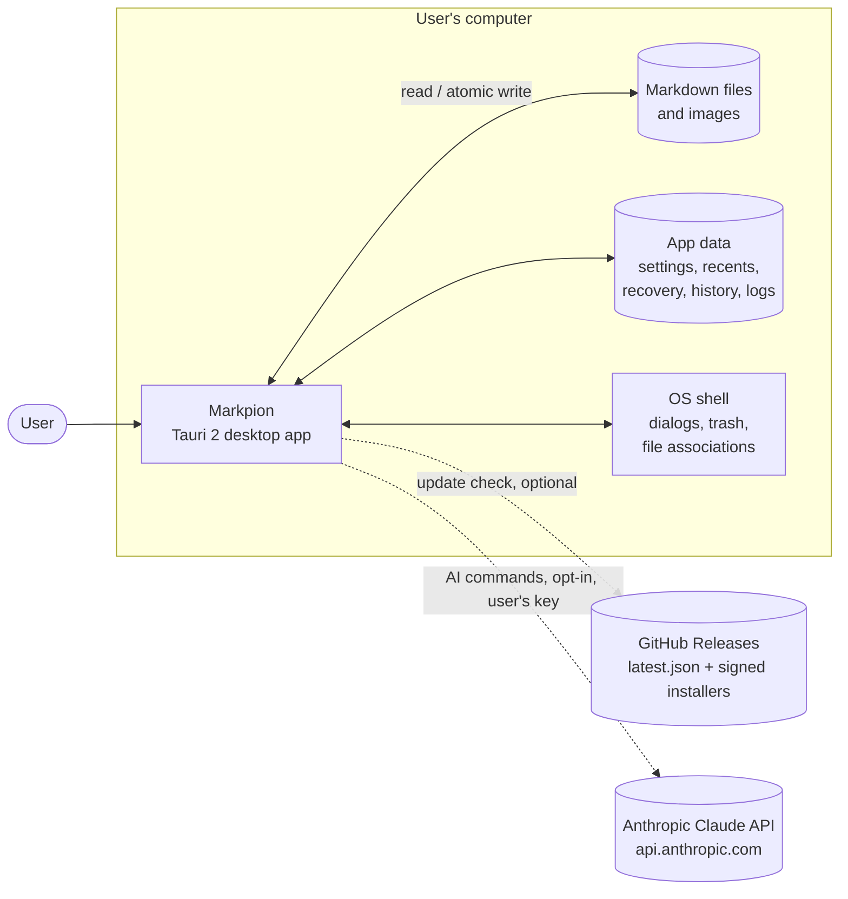

## 2. Technology stack

| Layer | Technology |
| --- | --- |
| Desktop shell | Tauri 2 (Rust), system web view (WebView2 on Windows, WebKit on macOS and Linux) |
| UI | React 19 + TypeScript, built with Vite |
| Editor | CodeMirror 6 (Markdown language, search, lint, autocompletion) |
| Preview | react-markdown on unified: remark-gfm, remark-math, rehype-raw, rehype-sanitize, rehype-katex (MathML), rehype-highlight, rehype-slug; Mermaid for diagrams |
| State | Zustand stores |
| Export | HTML (unified), PDF (pdfmake; display math drawn by MathJax as SVG), Word (docx) |
| Import | Word (mammoth), PDF (pdf.js), HTML (turndown), CSV/TSV |
| Tests | Vitest, Playwright with axe-core (WCAG 2.1 AA), Rust unit tests |

Heavy libraries (Mermaid, KaTeX, MathJax, pdfmake, docx, mammoth, pdf.js) are loaded on first use, so they don't slow down startup.

## 3. Layered architecture

The frontend is split into four layers, and code only calls downwards. Every native operation goes through a single `Backend` interface, which has two implementations: the Tauri backend calls Rust commands, and the in-memory backend runs the same UI in a plain browser for the web demo and the end-to-end tests.

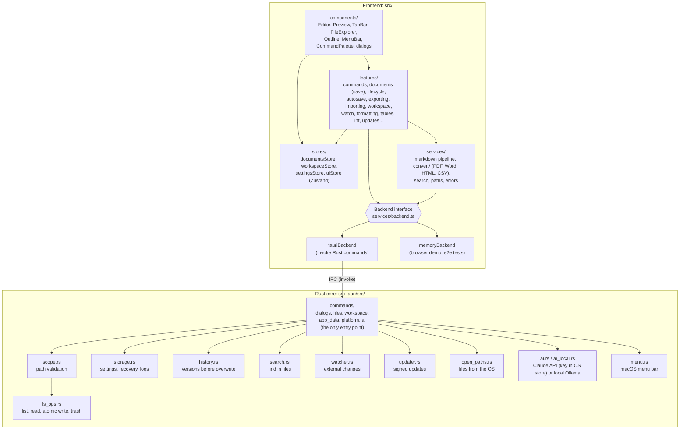

| Layer | Responsibility |
| --- | --- |
| `components/` | React views. They read stores and run commands; they don't do I/O. |
| `features/` | Use cases: open, save, export, import, auto save, recovery, commands and shortcuts. |
| `stores/` | Application state: open documents, workspace, settings, UI state. |
| `services/` | Pure logic and adapters: the Markdown pipeline, converters, the backend. |
| Rust `commands/` | One module per domain (`dialogs`, `files`, `workspace`, `app_data`, `platform`, `ai`), mirroring the frontend's backend interfaces. Validates every request, then calls the filesystem, storage, history and AI modules. |

## 4. Security boundary

The web view is treated as untrusted. It has no filesystem, dialog or shell permissions: the Tauri capability (`src-tauri/capabilities/default.json`) grants only basic window operations. A path becomes usable only after the user picks it in a native dialog, opens it from the OS, or re-approves it from the recent files list. Every command checks its path against that approved scope before any I/O.

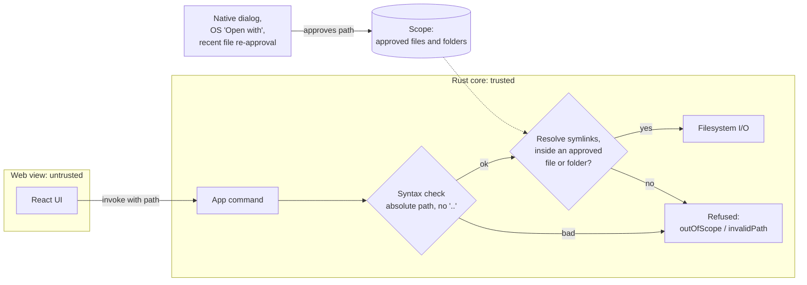

Other safeguards:

- **Preview:** raw HTML in documents is sanitized (rehype-sanitize) before rendering; math is rendered after sanitizing, so it can't be used to inject markup. The Content Security Policy allows scripts only from the app itself, no plugins or frames, and network requests (`connect-src`) only to the GitHub API; remote images in documents may still load.
- **Links:** external links open in the system browser, never inside the app window.
- **Custom CSS** (a setting) is parsed by the browser and rebuilt rule by rule with every selector under `.markdown-body`, so it can style documents but never the app, and a stray brace can't escape that scope. `@import` and unknown at-rules are dropped, and `</` is escaped where it's written into exported HTML.
- **Git** is read-only: the Rust core runs the user's `git` (`status`, and `show HEAD:./file` for a file already in scope) with optional locks and the fsmonitor hook turned off, a 10-second timeout and no console window. Markpion never commits, pulls or pushes.
- **Updates:** every installer is verified against the minisign public key built into the app before it runs.
- **AI assistant:** off by default. The Anthropic API key is kept in the OS credential store and read only by the Rust core, which makes the HTTPS request; the web view sends the instruction and text and gets the answer back, never the key. The document text is wrapped in `<document>` tags and the system prompt tells Claude to treat it as content, not instructions. Answers are shown for review and applied as one undoable edit.

## 5. Document model and lifecycle

Each open tab is a `Doc` in `documentsStore`: its path (`null` until first saved), the current `content`, the `savedContent` last loaded or saved, the line ending and BOM to write back, the file's modification time, any external change, and whether editing is locked (`readOnly`: the file is read-only on disk, or the user turned it on). A document is **dirty** when `content` differs from `savedContent`. A locked document takes changes only from outside the editor (reloads): CodeMirror's `readOnly` stops typing, a change filter stops commands, and the store ignores `setContent`.

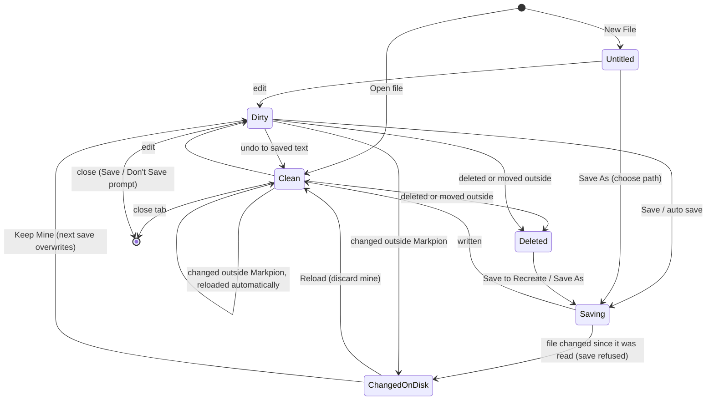

Open files' modification times are checked every 3 seconds. A clean document that changed on disk is reloaded silently; an edited one shows a banner with **Reload**, **Compare** (opens the disk version in a new tab) and **Keep Mine**. The workspace watcher (`watcher.rs`, debounced file events) keeps the file explorer current.

## 6. Saving safely

Saving never writes into the user's file directly. The previous version is kept in local history, the new text goes to a temporary file in the same folder, and the temporary file is renamed over the original in one step. A crash or power cut therefore leaves either the old file or the new one, never a half-written file.

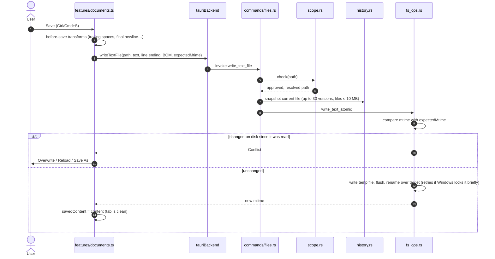

## 7. Crash recovery and auto save

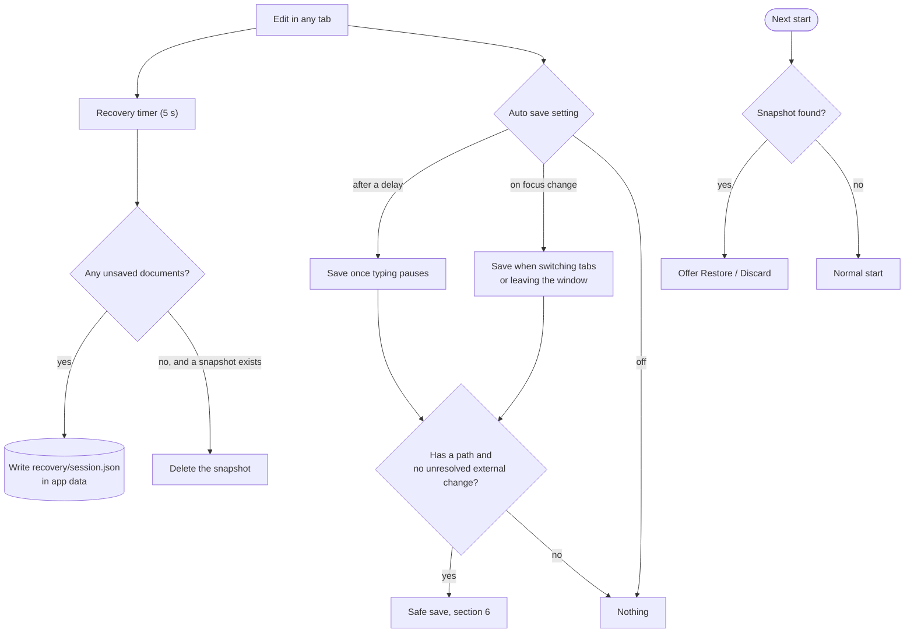

A normal close with unsaved documents asks Save / Don't Save / Cancel first, so the recovery snapshot only matters after a crash, a forced shutdown or a power cut.

## 8. Preview pipeline

The same unified pipeline (`services/markdown.ts`) feeds the live preview and the HTML export, so they look the same. The preview updates after a short pause in typing (a setting), and pauses for documents over 1 MB until the user asks it to render. For long documents a last rehype step (preview only) groups the top-level blocks into chunks; a chunk is a sized placeholder until it scrolls near the viewport, so only the visible part of the page is built (`components/PreviewChunks.tsx`). Before that, a preview-only step marks each top-level block with the source line it starts on (`data-line`, `services/sourceLines.ts`); split-view scrolling syncs by interpolating between those lines rather than by scroll proportion, and a double-click in the preview uses them to find the source.

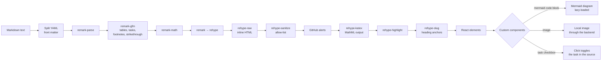

## 9. Import and export

Converters work on the Markdown syntax tree (mdast), not on the rendered HTML, so each format gets native structures: real Word headings, lists and footnotes, and PDF bookmarks and links.

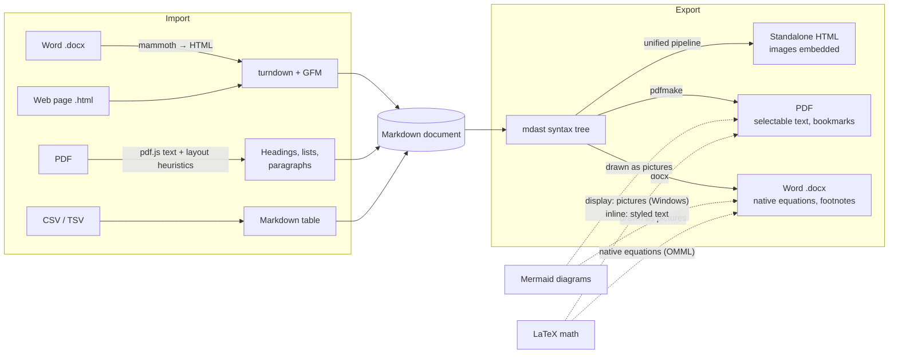

## 10. Where data is stored

| Data | Location | Written by |
| --- | --- | --- |
| Documents and images | Wherever the user keeps them | Safe save (section 6); pasted images go to `assets/` (or the one folder name set in Settings, validated natively as a single name) next to the document |
| Settings | App config folder, `settings.json` | `storage.rs` (written through a temporary file) |
| Recent files and folders | App config folder, `recent.json` | `commands/app_data.rs` |
| Crash recovery | App data folder, `recovery/session.json` | Recovery timer (section 7) |
| File history | App data folder, `history/` | `history.rs`, before each overwrite |
| Diagnostic log | App log folder, `markpion.log` (1 MB cap) | `storage.rs` Logger; exportable from Help |
| Anthropic API key (optional) | Windows Credential Manager, macOS Keychain; on Linux `ai-key` (mode 600) in the app config folder | `ai.rs` |

The app folders are named after the bundle identifier, `com.markpion.app` (for example `%APPDATA%\com.markpion.app` on Windows). On first start Markpion copies them from `com.markdownstudio.app`, the identifier used before the app was renamed.

## 11. Updates

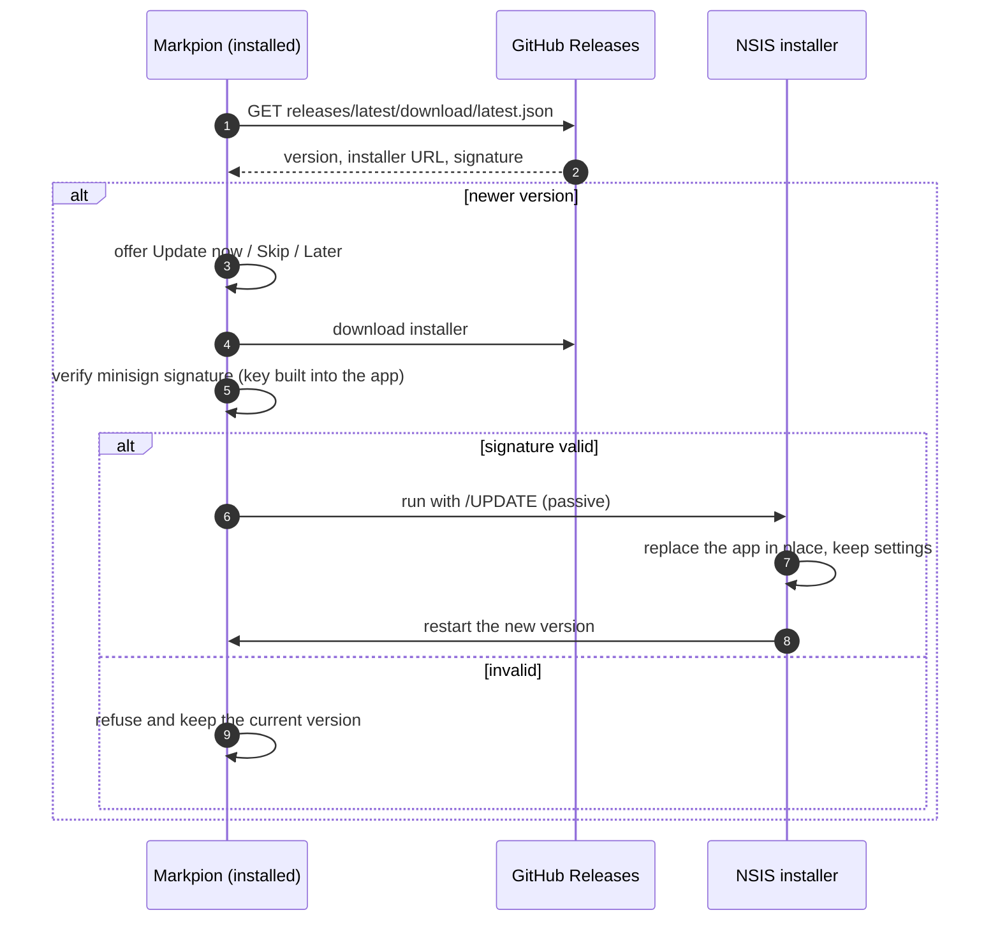

In-place updates are Windows-only for now; on macOS and Linux the app offers the download page.

## 12. Build and release

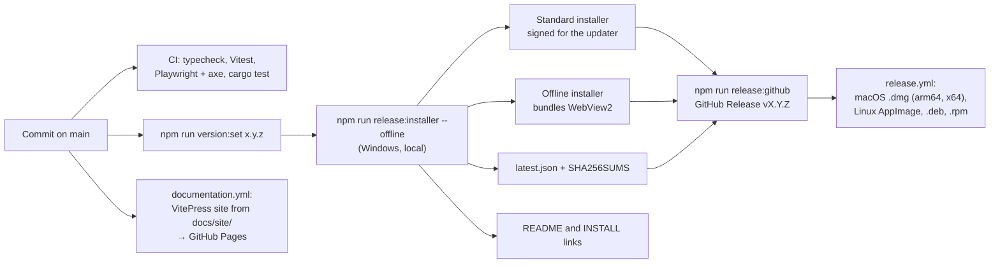

The updater's private signing key never enters the repository; it stays in `~/.tauri/` on the release machine.

## 13. Backend adapters and the road to a cloud version

The UI depends on one interface, `Backend` (`src/services/backend.ts`), split by domain. Each domain can be implemented and replaced on its own, and `capabilities` tells the UI what the current host can do, so features adapt instead of checking "am I the desktop app?".

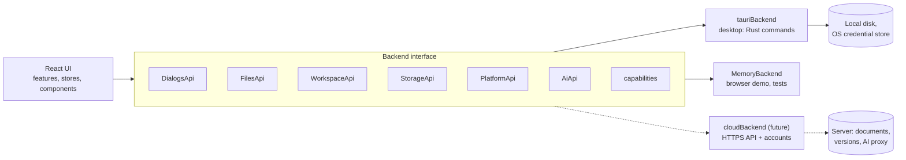

| Domain | Desktop today | What a web/cloud version would provide |
| --- | --- | --- |
| `DialogsApi` | Native Open/Save pickers that approve paths | In-app pickers over the user's cloud folders |
| `FilesApi` | Scope-checked disk I/O; reads report read-only files; saves carry the last-seen modification time | REST calls; the same `expectedMtime` field carries a revision/ETag, so conflict detection works unchanged |
| `WorkspaceApi` | Folder listing, search (Rust, with include/exclude globs), file watcher, read-only Git (status, and a file's committed text for change bars and File History) | Server-side listing and search; change notifications over a WebSocket |
| `StorageApi` | Settings, recents, recovery and history in app-data folders | Per-account settings and server-side version history |
| `PlatformApi` | Window title, full screen, the close guard (Save / Don't Save when the window closes), reveal in folder, OS "Open with", signed self-update, the native menu bar on macOS (`setNativeMenu` returns false elsewhere; chosen items come back through `onMenuCommand`; the menus themselves, with their submenus, come from `features/menus.ts`, the same model as the in-app menu bar) | The page title, the browser's Fullscreen API and a "leave page?" warning; the rest is absent (`capabilities` switches those UI features off) |
| `AiApi` | The Rust core calls Anthropic with the user's key from the OS credential store, or a local Ollama server (`localUrl`; loopback addresses only; `aiLocalModels` lists its models) | A server endpoint calls Anthropic with an organisation key, applying quotas and policies |

Design rules that keep this path open:

- **Paths are opaque to the UI.** Features pass the strings the backend returns; path helpers only format them for display and resolve relative Markdown links.
- **No feature talks to the OS or network directly**; it goes through `Backend`, and asks `capabilities` before offering host-specific actions. Only `services/` imports Tauri; `services/index.ts` is the one place that picks the host. A host whose backend is heavy or asynchronous loads it in `loadBackend()`, which `main.tsx` awaits before the first render (the browser demo's `MemoryBackend` loads this way, so the desktop app never downloads it).
- **Stores hold state, features hold workflows, services hold pure logic** (Markdown pipeline, converters, parsers). Pure logic is shared by every backend and runs in tests without a host.
- **Heavy features load on demand** (converters, Mermaid, KaTeX, the AI module, and the History, Keyboard Shortcuts, AI review, Settings and About dialogs and the Links panel, which are fetched a few seconds after startup), so a web build keeps a small first download.
- **Per-feature state stays separate** (for example `aiStore`), so new features don't grow one global store.

## 14. Design principles

- **Local first.** Files stay plain Markdown on the user's disk, readable without Markpion. No account, no cloud.
- **Never lose work.** Atomic saves, conflict detection, file history, crash recovery, and trash instead of permanent deletion. A rendering error is contained to its area (error boundaries), so the rest of the window, including saving, keeps working.
- **Least privilege.** The web view can't touch the filesystem; the Rust core validates every path.
- **One pipeline.** Preview and HTML export share the Markdown pipeline; exports convert the syntax tree to each format's native structures.
- **Fast start.** Heavy features load on first use, and the start-up JavaScript has a budget checked in CI (`npm run check:startup`). The Markdown editor's HTML support is a light version (`services/markdownHtml.ts`) without the CSS and JavaScript parsers the full HTML language bundles.
- **Stay responsive.** Rust commands check the scope first, then do file I/O on the blocking thread pool; large binary data crosses to the UI as raw bytes; long documents are previewed section by section (`services/markdownSections.ts`), parsing only what comes into view and re-parsing only the sections an edit touches; and above 1 MB of text the per-keystroke extras (live preview, checks, change markers, live counts) step back so typing doesn't.
- **Testable without the desktop shell.** The `Backend` interface lets the whole UI run in a browser, which is how the end-to-end and accessibility tests run.
- **One design system.** The UI's colours, type sizes, spacing, corner radii, shadows and layers are tokens (`src/styles/app/tokens.css`, with a dark value for every theme colour); each UI area has its own stylesheet, and a test rejects literal values and repeated selectors. Menus, the macOS menu bar and the command palette share one menu model (`features/menus.ts`).
