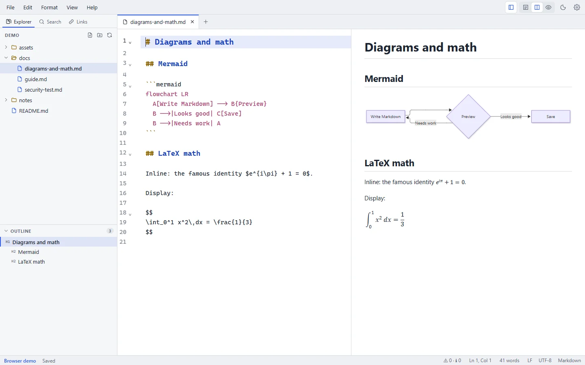

# Features

This page lists what Markpion does today. Each feature links to its guide. Planned work is on the [roadmap](/roadmap).

<figure>
  
  <figcaption>Mermaid diagrams and LaTeX math render in the live preview.</figcaption>
</figure>

## Writing and editing

- A CodeMirror 6 editor with Markdown syntax highlighting, highlighting for code-block languages, line numbers, code folding, multiple cursors, and undo and redo per tab. [Editor guide](/guide/editor)
- A Format menu and shortcuts for bold, italic, strikethrough, inline code, links, headings 1–6, promoting and demoting headings, numbering headings (1., 1.1, 1.1.1), bulleted, numbered and task lists, quotes, code blocks, horizontal rules and footnotes, and a Table menu for tables. [Writing tools](/guide/writing-tools)
- A formatting toolbar above the editor (undo, paragraph style, bold, italic, lists, links, images, tables and more) that shows the formatting at the cursor; inside a table it offers the table tools. [Editor](/guide/editor#formatting-toolbar)
- **Move Section Up/Down** moves a heading with its text and subsections past its neighbour.
- Tables: **Format Table** aligns columns (CJK-aware), **Tab** and **Shift+Tab** move between cells (Tab in the last cell adds a row), rows and columns can be inserted or deleted at the cursor, and **Sort Table by Column** sorts rows. You can also paste cells from Excel or Google Sheets as a table, and copy a table as CSV. [Tables](/markdown/tables)
- A table of contents that stays up to date on save, and templates for new documents (meeting notes, README, blog post, ADR, status report, changelog, journal, plus your own). [Writing tools](/guide/writing-tools)
- Wiki links (`[[Page]]`) as well as Markdown links. Link autocompletion for workspace files, images, headings (also in other documents: `](guide.md#`), reference labels and footnotes. Ctrl/Cmd+click (or Alt+Enter) follows a link from the editor, and hovering an image link shows the picture (a link to another document shows the start of it). Paste a URL over selected text to make a link. Convert links between inline and reference style.
- Paste or drop images, or choose one with **Format → Insert Image…**. Images from elsewhere are copied into an `assets/` folder next to the document and linked. [Images](/markdown/images)
- Rich paste: content copied from web pages or Word is converted to Markdown.
- Spell checking with the system dictionary, a word count with document and selection statistics, task progress and a word count goal in the status bar, a line length setting that keeps the text a readable width, dimming of all but the paragraph being written, Focus Mode and Full Screen.

## Preview

- A live GitHub-style preview with a configurable update delay, scrolling synced by source line, double-click in the preview to find the source, and editor-only, split and preview-only views. [Preview guide](/guide/preview)
- GitHub Flavored Markdown: tables, task lists, strikethrough, autolinks, emoji shortcodes (`:tada:`), and fenced code with syntax highlighting and a Copy button in the preview. [GFM](/markdown/gfm)
- Clickable task checkboxes that update the source.
- [Mermaid diagrams](/markdown/mermaid) and [LaTeX math](/markdown/math).
- [YAML front matter, GitHub alerts and footnotes](/markdown/extras).
- Long documents: the preview builds the part you are looking at first. Above 1 MB of text, the live preview pauses and renders on demand, so typing stays fast.
- Present a document as slides (View → Slides → Present as Slides), split at `---` lines or at headings, with speaker notes. [Preview](/guide/preview#presenting-as-slides)

## Files and workspaces

- Git status: changed files are marked in the Explorer and the branch is shown in the status bar; the editor marks lines changed since the last commit, and a click shows or reverts a change (needs Git; never commits). [File explorer](/guide/file-explorer#git-status)
- Open a single file or a whole folder. The file explorer can create, duplicate, rename (F2), move (drag and drop, or Move To…) and delete files and folders (to the Trash or Recycle Bin), reveal them in your file manager, and copy their paths; drag a file or picture into the editor to link to it, preview pictures, or move a selected section into a new file. Links to a renamed or moved file are updated after you confirm. [File explorer](/guide/file-explorer)
- Tabs with unsaved-change markers, reordering, context actions (Close Others, Close to the Right, Close Saved), and Reopen Closed Tab. [Tabs](/guide/tabs)
- Find and replace in the document (case, whole word, regex), find in the rendered preview, and Find in Files and Replace in Files across the folder, optionally limited to some files or folders (unsaved files are skipped; previous versions go to File History). [Search & replace](/guide/search-replace)
- A document outline (drag to reorder sections, copy a link to a heading), Rename Heading (F2) that updates the links to it, snippets, a daily note, a command palette, Go to Heading (jump to a heading by typing part of it, in the document or in the whole folder), Go to Tag and Rename Tag (`#tags` across the folder), Go to File (open any file in the folder by typing part of its name), a filter box in the Explorer, and recent files and folders.
- Breadcrumbs above the editor: the cursor's heading path (**Guide › Install › Windows**); click a part to jump to another heading at that level. [Editor](/guide/editor#breadcrumbs)
- Menus grouped into short submenus (Open Recent, Import, Export, Heading, Insert, Fold…), with check marks for settings that are on (Word Wrap, Line Numbers, the view mode) and full keyboard control. The command palette shows where each command is in the menus. [Search & replace](/guide/search-replace#command-palette)
- Live folder watching: the explorer and open files update when other programs change files on disk.
- Opens files from your operating system: double-click, "Open with", or drag and drop onto the window. On Windows, the right-click menu has **Open with Markpion**.

## Saving and safety

- Atomic saves, detection of files changed on disk (Reload, Compare or Keep Mine), and clear errors with next steps. [Saving & recovery](/guide/saving-and-recovery)
- Optional auto save after a delay or when switching tabs or windows.
- Rename a file from its tab, or from the Explorer's list of open files when no folder is open. [Tabs](/guide/tabs#tab-context-menu)
- Compare the document with another file in the folder (File → Compare with File…). [Saving](/guide/saving-and-recovery#comparing-two-documents)
- Read-only files open locked, with Save As or Edit Anyway; View → Editor → Read-Only protects any document from accidental edits. [Saving](/guide/saving-and-recovery#read-only-files)
- Local file history: the previous version is kept on every save (30 per file), with a line diff that marks the changed words, and restore; also your unsaved changes against the saved file, and the last commit for files in Git.
- Crash recovery for unsaved documents, and session restore of the last folder and files.
- UTF-8 with or without BOM; LF and CRLF line endings are preserved per file.
- Save options: trim trailing whitespace, insert a final newline, and choose line endings for new files.

## Checking documents

- Markdown lint in the editor: broken links, missing images, broken anchors, duplicate headings, skipped heading levels, `#Title` or `-item` without a space, bold with inner spaces, paths with spaces, missing alt text and link text, table rows that don't match the header, and footnotes or reference links without a definition, with a Problems panel and quick fixes (Add Blank Line, Add Empty Cells, Add Definition, fix a skipped heading level, correct a misspelled #anchor or file name) and Edit → Fix All Problems. [Checking documents](/guide/checking-documents)
- A link check across the whole folder, including `file.md#heading` anchors, and a list of the files that link to the open document, or name it without a link.

## Import and export

- **Import** Word (`.docx`), PDF, web pages (`.html`), EPUB e-books and CSV/TSV as Markdown, one file at a time or a whole folder. [Import & export](/guide/import-export)
- **Export** to PDF (selectable text, links, bookmarks) and Word (`.docx`) on A4 or Letter paper with real headings, lists and tables, to standalone HTML, as an EPUB e-book (table of contents, pictures, math and diagrams included), as a LaTeX document (math kept as written), as a `.zip` with the document and its pictures, or through Print → Save as PDF. You can also Copy as Formatted Text (paste into Word, email or Google Docs), Copy as Plain Text or Copy as HTML.
- **Combine a folder** into one document with a table of contents, export a whole folder as one PDF or Word file, or as an **HTML site** with a page per document, working links and a contents page.

## App

- Light, dark and system themes; configurable editor font, size, wrapping and tab size. [Settings](/guide/settings)
- Keyboard-first: every command has a menu entry, many have [shortcuts](/reference/keyboard-shortcuts), and the command palette finds them all.
- Export and import settings and shortcuts as a file, to move to another computer or share a team setup. [Settings](/guide/settings#export-and-import)
- **Fix Table** repairs a table typed with mistakes (a missing divider row, short or long rows, missing pipes) in one step. [Tables](/markdown/tables#table-tools)
- Line tools: sort lines, remove duplicate lines, join lines, reflow (hard-wrap) or unwrap paragraphs, and change case (upper, lower, title). Typing `*`, `` ` `` or a bracket with text selected wraps it. [Editor](/guide/editor#editing-lines)
- Customizable keyboard shortcuts for every command (Help → Keyboard Shortcuts), with conflict detection. [Keyboard shortcuts](/reference/keyboard-shortcuts#change-a-shortcut)
- Custom CSS for your documents (preview, printing, slides and HTML export), for example your organization's colours and fonts; it never changes the app itself. [Settings](/guide/settings#preview)
- Accessibility: keyboard navigation and visible focus throughout (F6 moves between the sidebar, editor and preview); the UI is audited automatically against WCAG 2.1 AA in light and dark themes; in Windows High Contrast (and other forced-colour modes), selections, the active tab, focus and unsaved-change markers stay visible.
- Automatic updates on Windows, verified with a signature before installing. macOS and Linux are notified of new versions.
- Diagnostic logs you can export for support. They never contain document text.

## AI assistant (optional)

- Off by default. With your own Anthropic API key, the **AI** menu asks Claude to improve, fix, shorten, summarize, translate or continue the selected text, to follow your own instruction (**Ctrl+J**), or to write new text at the cursor from an instruction alone (**Ctrl+Shift+J**). You review and can edit every answer before it changes the document, and the key stays in the system's credential store. Or use a local model through Ollama, so the text never leaves your computer. [AI Assistant](/guide/ai-assistant)

## Not included

These aren't part of Markpion today. Some are [on the roadmap](/roadmap):

- Cloud sync, collaboration, Git integration and plugins.
- MDX, and Markdown flavours beyond GitHub Flavored Markdown with the extensions listed above.
- Signed installers (Windows Authenticode, Apple notarization) and ARM64 builds for Windows and Linux.
