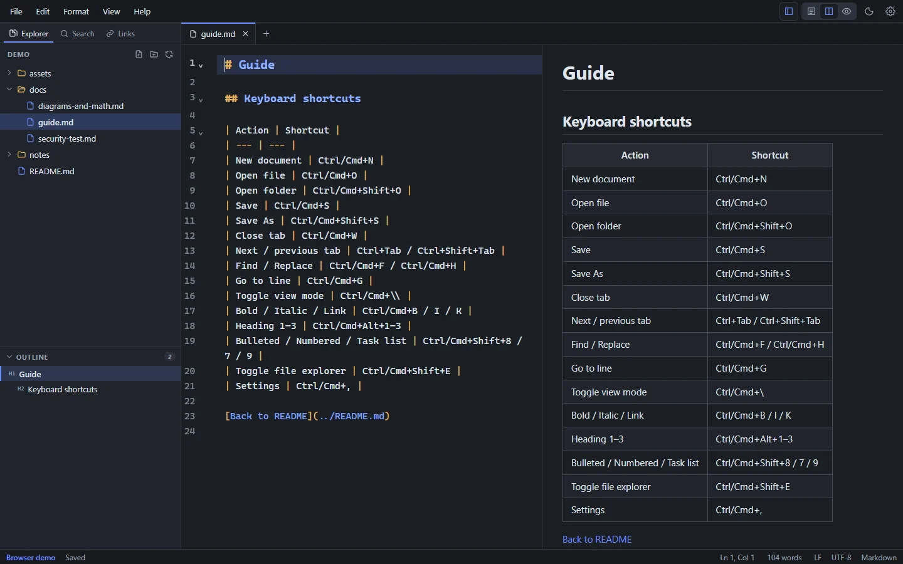

# File explorer

The file explorer shows the folder you're working in, your **workspace**. Open it with **File → Open Folder…** (**Ctrl+Shift+O**, or **Cmd+Shift+O** on macOS). Show or hide the sidebar with **Ctrl+Shift+E**.

<figure>
  
  <figcaption>The Explorer (top left) and Outline (bottom left), in the dark theme.</figcaption>
</figure>

### Without a folder

When no folder is open, the Explorer lists your **open files**, and below them your **recent** files and folders that aren't open (click one to open it, or its **×** to remove it from the list; nothing is deleted). Click one to switch to it, press **F2** to rename it, or right-click it for **Rename…**, **Open Containing Folder…**, **Copy Path**, **Reveal in File Explorer** and **Close**. Below the list, **Open Folder** opens a folder; the dialog starts in the current file's folder, so opening the folder your file is in takes one click.

## What's shown

- Folders, Markdown files (`.md` and `.markdown`) and pictures, sorted with folders first. Pictures have a picture icon; clicking one shows it (see **Pictures** below). To list only Markdown files, turn off **Settings → Files → Show pictures in the Explorer**.
- Hidden folders (starting with `.`) and dependency or build folders such as `node_modules`, `target`, `dist` and `build` are skipped.
- Folders load when you expand them, so large folders open quickly.
- The file in the active tab is highlighted.

## Filter files

Type in **Filter files** at the top of the Explorer to list only the files whose name or path matches, from every folder, best matches first (up to 200). The letters don't need to be next to each other: `setgd` finds `docs/setup-guide.md`. Click a file, or press **Enter** for the first one, to open it; **Down** moves into the list. **Escape** clears the filter and shows the tree again.

## Create, rename and delete

| Action | How |
| --- | --- |
| New file | The **New file** button at the top of the Explorer, or right-click a folder → **New File…** |
| New folder | The **New folder** button, or right-click a folder → **New Folder…** |
| Duplicate | Right-click a file → **Duplicate**. The copy is named like `notes copy.md` (or `notes copy 2.md`, … if that exists), keeps the original's line endings, and opens. It copies the saved file, so unsaved changes in an open tab aren't included |
| Rename | Select an item and press **F2**, or right-click → **Rename…**. Open tabs follow the rename, and links to it can be updated (see below) |
| Move | Drag a file or folder onto another folder, or onto the empty space below the tree for the top level; **Esc** cancels. From the keyboard: right-click (or **Shift+F10**) → **Move To…** and type the folder, relative to the open folder (`/` for the top level). Nothing is replaced: moving onto a name that already exists is refused. Open tabs follow the move, and links to it can be updated (see below) |
| Split a document | Select text, such as a whole section, and choose **File → Move Selection to New File…**. The text goes into a new Markdown file in the same folder, named after its first heading, and a link to that file takes its place. **Ctrl+Z** in the document brings the text back (the new file stays) |
| Link to a file | Drag a file from the Explorer into the editor: a link to it goes where you drop it, relative to the document (`[guide](docs/guide.md)`). A picture gets an image link (``). The file isn't moved. The document must be saved first, so the link has a place to start from |
| Pictures | The Explorer lists pictures (PNG, JPEG, GIF, WebP, SVG, BMP, AVIF) as well as Markdown files; turn that off with **Settings → Files → Show pictures in the Explorer**. Click a picture to see it, with **Insert Link in Document** to link it at the cursor; drag it into the editor to link it where you drop it. Rename, move and delete work as for documents, and renaming or moving offers to update the links that show it |
| Delete | Right-click → **Delete…**. After you confirm, the item goes to the Trash or Recycle Bin, so it can be restored |
| Collapse folders | The **Collapse folders** button closes every expanded folder |
| Refresh | The **Refresh** button |
| Close the folder | The **×** button at the top of the Explorer, or **File → Close Folder**. The folder leaves the Explorer; nothing is deleted, and open tabs stay open |

Other right-click actions: **Open**, **Reveal in File Explorer** (**Reveal in Finder** on macOS, **Open Containing Folder** on Linux), **Copy Path** and **Copy Relative Path**.

## Links follow renamed and moved files

When you rename or move a file or folder, Markpion looks through the Markdown files in the open folder for relative links and images that would stop working: links in other documents that point to it, and the moved documents' own links to files that stayed where they were. If it finds any, it asks **Update links?** with the number of links and files; **Update Links** rewrites them, **Don't Update** leaves every file as it is.

- Anchors (`#section`), a leading `./` and `<…>` brackets are kept; spaces and brackets in new names are written as `%20`, `%28` and `%29`.
- Files open with unsaved changes are skipped (the dialog names them). Open tabs without changes reload with the new links.
- The previous version of each rewritten file is kept in [File History](/guide/saving-and-recovery#file-history).
- Inline links and images (`[text](path)`, ``), reference-style link definitions (`[id]: path`), wiki links (`[[path]]`) and HTML `<a href>` and `` tags are updated. Absolute paths (`/home/me/notes/a.md`, `C:\notes\a.md`) are updated too when the file they name moves, and stay absolute with the same kind of slashes. Links in files outside the folder aren't updated; [Check Links in Folder](/guide/checking-documents) finds any that broke.
- Renaming or moving files outside Markpion (in your file manager or with Git) doesn't update links.

## Changes made by other programs

Markpion watches the workspace folder. When another program (Git, a script, another editor) adds, removes or changes files, the Explorer updates straight away.

If a file that's open in a tab changes on disk:

- If the tab has **no unsaved changes**, it reloads automatically.
- If it **has unsaved changes**, a banner offers **Reload (discard mine)**, **Compare** or **Keep Mine**, so nothing is overwritten without you deciding. See [Saving & recovery](/guide/saving-and-recovery#files-changed-on-disk).

## Workspace access

Markpion can read and write only inside folders and files you've opened yourself (or reopened from the recent list). That keeps the app from reaching anything else on your computer. See [Privacy](/privacy).

## Go to File

**File → Go to File…** (**Ctrl+Alt+O**, **Cmd+Option+O** on macOS) opens any Markdown file in the folder by typing part of its name or path, for example `guide` or `docs/inst`. The letters don't have to be next to each other: `dm` finds `diagrams-and-math.md`. Files that are already open are listed first. Press **Enter** to open the highlighted file.

## Recent files and folders

The **File** menu and the welcome screen list recently opened files and folders. By default, the next start reopens your last folder and files; turn this off with **Settings → Startup → Reopen last folder and files**.

To tidy the list, point at an entry on the welcome screen and click its **×**, or clear the whole list with **Clear** (on the welcome screen) or **File → Clear Recent**. Only the list changes; the files and folders stay where they are.

## Explorer and Outline size

The Outline sits below the Explorer. Drag the line between them to give either more room; the size is remembered. Click the **Outline** heading to collapse it to a single line, and again to expand it.

## Git status

When the open folder is in a Git repository, the Explorer marks changed files with a letter: **M** modified, **A** added, **D** deleted, **R** renamed, **U** untracked, **C** conflict. Folders that contain changes get a dot. The status bar shows the branch, with **↑** commits to push and **↓** commits to pull.

### Changed lines in the editor

For a file that's committed to Git, the editor shows a thin bar next to the lines you've changed since the last commit, as code editors do: **green** for added lines, **amber** for changed lines, and a small **red** triangle where lines were deleted. Hover over a bar to see what it means.

- **Click a bar** (or use **Edit → Show Change Since Last Commit**) to see the committed lines. **Revert Change** puts them back (**Ctrl+Z** undoes it); **Escape** closes the pop-up.
- **Alt+F5** and **Shift+Alt+F5** move the cursor to the next and previous change. **Edit → Revert Change to Last Commit** reverts the change at the cursor.

The status bar sums up the file's changes (for example `+3 ~1 −2`: added, changed and deleted lines); click it to go to the next change. The bars update as you type and after you commit (when you come back to the window). Untracked files and documents over 1 MB have no bars. In Windows High Contrast, added lines get a solid bar and changed lines a dashed one.

### Requirements and privacy

This needs Git installed. Markpion runs `git status` in the open folder (and `git show` for the file in the editor), read-only, when the folder opens, when files change, and when you come back to the window; it never commits, pulls or pushes. As with any Git tool, opening a repository runs Git with that repository's configuration (Markpion turns off Git's file-system monitor hook). Turn it off with **Settings → Files → Show Git branch and changed files**.

## Search, links and tags across the folder

The sidebar has three more views for the whole workspace:

- **Search** (**Ctrl+Shift+F**) finds text in every Markdown file. See [Search & replace](/guide/search-replace#find-in-files).
- **Links** checks every link in every file. See [Checking documents](/guide/checking-documents#link-check).
- **Tags** lists the `#tags` used in the folder. See [Tags](/guide/search-replace#tags).

When the sidebar is narrow, its tabs show only their icons; hover one for its name.
