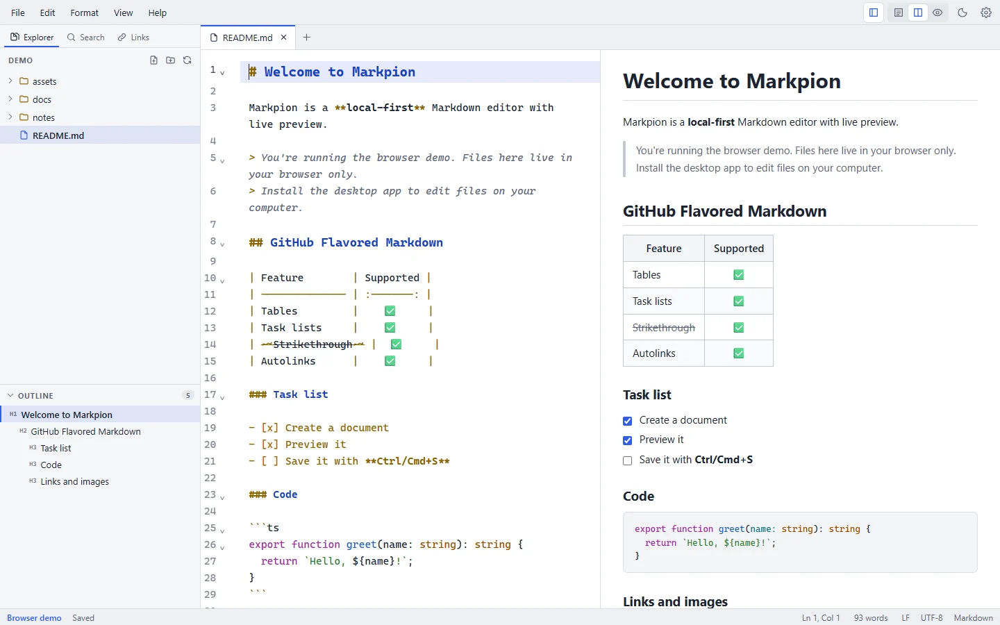

# Preview

The preview renders your Markdown as you type, in a style close to GitHub's. It supports [GitHub Flavored Markdown](/markdown/gfm), [Mermaid diagrams](/markdown/mermaid), [math](/markdown/math), and [front matter, alerts and footnotes](/markdown/extras).

<figure>
  
  <figcaption>Split view: the editor on the left, the preview on the right.</figcaption>
</figure>

## Views

Choose **Editor Only** (**Ctrl+1**), **Split View** (**Ctrl+2**) or **Preview Only** (**Ctrl+3**) from the **View** menu or the buttons at the top right. **Ctrl+\\** cycles through them. On macOS, use **Cmd**.

## Updates and scrolling

- The preview updates shortly after you stop typing. The delay is set by **Settings → Preview → Update delay after typing** (instant to 1 second; 150 ms by default).
- In split view, the editor and preview scroll together. Turn this off with **Sync editor and preview scrolling**.

## Interacting with the preview

- **Links:** web links (`http`, `https`, `mailto`) open in your browser. `#heading` links scroll to the heading. Links to other Markdown files open them in a new tab. Other link types are blocked for safety.
- **Task checkboxes:** click a checkbox (or focus it and press **Space**) to check or uncheck the task in the source. It's a normal edit, so **Ctrl+Z** undoes it.
- **Images:** local images are loaded relative to the document. They only show once the document is saved, because a relative path needs a location. See [Images](/markdown/images).

## Safe HTML

Raw HTML in Markdown is rendered, then **sanitized with GitHub's allow-list**. Scripts, event handlers, iframes, forms, styles and `javascript:` links are removed, and a strict Content Security Policy blocks inline scripts. So a document you download can't run code in Markpion.

## Large documents

Long documents (from about 150 paragraphs, headings, lists and other blocks) are rendered in parts: the parts near what you're looking at are built first, and the rest as you scroll to them. Jumping from the outline or following a `#link` builds the whole preview first. On macOS the preview can shift slightly while a part above the visible area is built.

Above **1 MB** of text, the live preview pauses so typing stays fast. A bar at the top of the preview offers **Render Now** (and then **Refresh Preview**) to render on demand. The editor handles large files normally, and files up to 50 MB can be opened.

## Presenting as slides

**View → Present as Slides** (also in the command palette) shows the current document as slides that fill the window. Press **F11** first for full screen.

- Put a line with just `---` between slides, with a blank line before it (a `---` directly under a line of text makes that line a heading instead). A document without any `---` gets a slide for each `#` and `##` heading.
- **→**, **↓**, **Space** or **Page Down**, or a click on the slide, go to the next slide; **←**, **↑**, **Shift+Space** or **Page Up** go back; **Home** and **End** go to the first and last slide.
- **Esc** ends the show.
- Slides show everything the preview does: images, tables, code, formulas and diagrams. Links open in your browser. Front matter isn't shown.

```markdown
# Quarterly review

---

## Agenda

- Results
- Roadmap
```

## Printing and exporting

What you see in the preview is what **Export as HTML**, **Export as PDF**, **Export as Word** and **Print / Save as PDF** produce, without the front matter table. See [Import & export](/guide/import-export#export).
